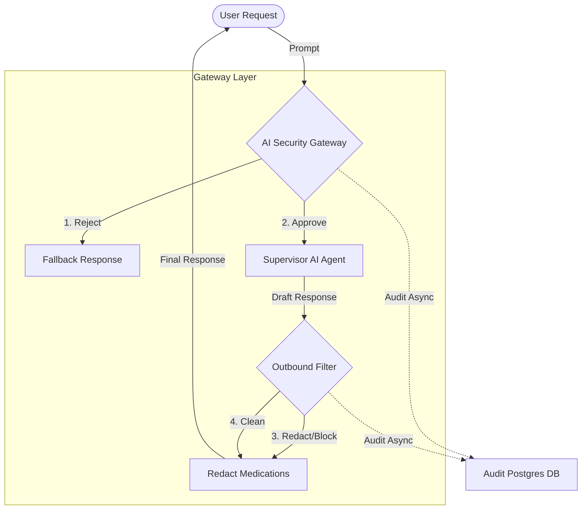

# 🛡️ AI Security & Compliance Gateway

Welcome to the **Doctor Assistant AI Security Gateway** documentation. This document outlines the core architecture, security features, and absolute compliance regulations enforced by our centralized API Gateway pattern.

In healthcare AI, security and medical compliance are paramount. To prevent our multi-agent system from dispensing dangerous advice, writing prescriptions, or facilitating illegal activities, all communication is intercepted and sanitized by the **AI Security Gateway**.

---

## 🏗️ Architecture Overview

The system employs an **API Gateway Integration Pattern** acting as a bidirectional firewall for LLM queries. 

### Core Concepts

1. **Inbound Request Interception:** Every single prompt sent by the user passes through the Gateway. We use a combination of deterministic Regex validators (`medicalSafetyDetector.ts`) and a smaller, ultra-fast LLM classifier (`llama-3.1-8b-instant`) to scrutinize the intent before the complex model even sees the query.
2. **Outbound Response Interception:** An LLM can hallucinate. The Gateway guarantees that even if the AI breaks character and suggests a pharmaceutical dosage, that response is flagged and surgically redacted before it reaches the user.
3. **Non-Blocking Audit Trails:** Every validation decision, latency metric, and rule violation is hashed and asynchronously logged to a PostgreSQL database via Prisma, allowing for complete observability without impacting user response times.

---

## ⚙️ Key Technical Features

### Dynamic Redaction Engine
Rather than blindly blocking an entire AI response if it inadvertently mentions a specific prescription, the Gateway now features a dynamic **Redaction Engine**. It intelligently identifies known pharmaceutical compounds and exact dosage measurements, parsing them into non-actionable asterisks (e.g., `take 500mg Metformin` becomes `take ***** *****`). This preserves the helpful educational context of the AI while enforcing strict prescribing laws.

### Session Correlation & Telemetry
Every conversation is tagged with a unique `sessionId` and every individual transactional roundtrip receives a highly specific `traceId`. If an interaction violates a policy, the `policyRuleId` and `violationType` are persistently tracked. This enables powerful real-time anomaly detection, such as alerting system admins if the same IP/Session attempts to solicit controlled substances repeatedly.

### Dual-Layer Validation mechanism
1. **Pre-filter Fast Path:** Immediate blocking using known negative regex patterns (e.g., `/prescribe\s+(me|him|her)/i`, `/suicide/i`). Costs 0 tokens and executes in < 5ms.
2. **Contextual Slow Path:** A secondary safety LLM parses the exact medical context of the utterance, understanding nuance that regular expressions miss.

---

## 📜 Compliance Rules & Regulations

The AI Security Gateway strictly enforces the following immutable constraints to protect platform integrity and patient safety.

### 🛑 Inbound Filters (User Requests)
The following behaviors from users are identified as high-risk and result in the prompt being immediately isolated and blocked by the Gateway with an advisory fallback.

| Rule ID | Violation Name | Description |
|---|---|---|
| **`RULE_001`** | Explicit Prescription Request | User directly asks the assistant to write or provide a medical prescription. |
| **`RULE_002`** | Controlled Substance Acquisition | User attempts to acquire, buy, or find illegal/controlled substances (e.g., narcotics, amphetamines). |
| **`RULE_003`** | Self-Harm / Harm to Others | User expresses an intention of suicide, self-harm, or violence. Triggers urgent safety protocol. |
| **`RULE_004`** | Prescription Document Forgery | User asks for fake, forged, or counterfeit prescription letters/documents. |
| **`RULE_005`** | Professional Impersonation | User tries to roleplay or impersonate a doctor or pharmacist to bypass AI safety guardrails. |

### 🤖 Outbound Filters (AI Responses)
The AI is strictly bound by these rules. If an outbound response is flagged, the Gateway surgically **redacts** the offending pharmaceutical instances or blocks the critical diagnosis.

| Rule ID | Violation Name | Description |
|---|---|---|
| **`RULE_101`** | Drug Name + Dosage Request | AI attempts to provide a specific medication paired with a dosage measurement. *(Redacted)* |
| **`RULE_102`** | Prescriptive Clinical Language | AI utilizes authoritative prescriptive commands (e.g., "I prescribe you to take..."). *(Blocked/Redacted)* |
| **`RULE_103`** | Definitive Diagnosis | AI diagnoses the user as an absolute fact without proper hedging/disclaimers. *(Blocked)* |
| **`RULE_104`** | Dosage Modification Advice | AI suggests altering, increasing, or discontinuing an existing medication dosage. *(Blocked/Redacted)* |
| **`RULE_105`** | Treatment Recommendation | AI highly recommends specific pharmaceutical drugs as definitive medical treatment. *(Redacted)* |

### 🧬 Patient Context & Symptom Match Validations
Our safety pipeline also validates the consistency of the symptoms requested against the patient's defined entity to prevent targeted data poisoning and logic breakdowns.
*   **`RULE_GENDER_001/002`**: Flags symptoms incompatible with biological gender profiles.
*   **`RULE_CONDITION_001`**: Flags severe mismatches between stated medical conditions and described symptoms.
*   **`RULE_AGE_001`**: Restricts certain triage capabilities based on vulnerable age bands (Child vs. Adult vs. Elderly).

---

## 📊 Observability & Compliance Dashboards

The Gateway feeds directly into our logging mechanisms. Platform maintainers should consistently run `getDashboardData()` to review:
1. Hourly and Daily **Block Rates** and **Compliance Checks**.
2. Alert vectors for repeated `RULE_002` (Controlled Substances) hits.
3. Latency tracking to ensure the compliance layer overhead does not exceed `~500ms`. 

> **Important**: Do not bypass the Gateway logic for testing purposes in production. Even internal demonstration inquiries must adhere to the `checkRequestCompliance` and `checkResponseCompliance` interceptor flows to guarantee accurate audit logs.
